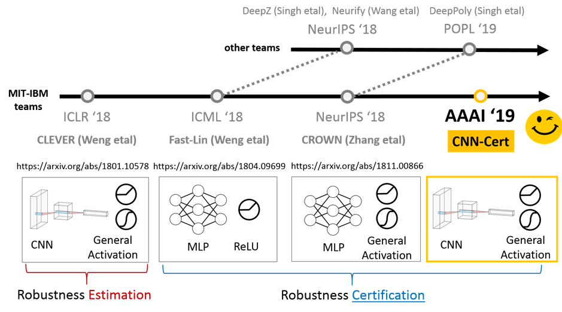

AI verification
=================

   * [AI verification](#ai-certification)
      * [Certification for Neural network](#certification-for-neural-network)
         * [Overview](#overview)
         * [AI Explainability 360](#ai-explainability-360)
         * [Adversarial Robustness 360 Toolbox (ART)](#adversarial-robustness-360-toolbox-art)
         * [PROVEN: Verifying Robustness of Neural Networks with a Probabilistic Approach](#proven-verifying-robustness-of-neural-networks-with-a-probabilistic-approach)
         * [CROWN: A Neural Network Verification Framework](#crown-a-neural-network-verification-framework)
         * [Efficient Neural Network Robustness Certification with General Activation Functions](#efficient-neural-network-robustness-certification-with-general-activation-functions)
         * [Certified Adversarial Robustness via Randomized Smoothing](#certified-adversarial-robustness-via-randomized-smoothing)
         * [CNN-Cert: An Efficient Framework for Certifying Robustness of Convolutional Neural Networks](#cnn-cert-an-efficient-framework-for-certifying-robustness-of-convolutional-neural-networks)
         * [THE ROBUSTNESS OF NEURAL NETWORKS: AN EXTREME VALUE THEORY APPROACH](#the-robustness-of-neural-networks-an-extreme-value-theory-approach)
         * [Robustness Verification of Tree-based Models](#robustness-verification-of-tree-based-models)
         * [Efficient Formal Safety Analysis of Neural Networks](#efficient-formal-safety-analysis-of-neural-networks)
         * [A Game-Based Approximate Verification of Deep Neural Networks with Provable Guarantees](#a-game-based-approximate-verification-of-deep-neural-networks-with-provable-guarantees)
         * [DeepGO: Reachability Analysis of Deep Neural Networks with Provable Guarantees](#deepgo-reachability-analysis-of-deep-neural-networks-with-provable-guarantees)
      * [Attack and Robustness](#attack-and-robustness)
         * [Robust-and-Explainable-machine-learning](#robust-and-explainable-machine-learning)
         * [Is Robustness the Cost of Accuracy? A Comprehensive Study on the Robustness of 18 Deep Image Classification Models](#is-robustness-the-cost-of-accuracy-a-comprehensive-study-on-the-robustness-of-18-deep-image-classification-models)
         * [AutoZOOM: Autoencoder-based Zeroth Order Optimization Method for Attacking Black-box Neural Networks](#autozoom-autoencoder-based-zeroth-order-optimization-method-for-attacking-black-box-neural-networks)
      * [Related Topics](#related-topics)

 [中文版](README_cn.md)
 
AI verification is a special point to view the booming research and applications of AI, especially deep learning.

Considering the wide and rapidly increasing use of AI among all kinds of industry, a professional inspection and certification from 
third-party organizations becomes important for both customers and the whole society.  

Data plays an unprecedented role in deep learning. It also unavoidably involves public issues, such as **privacy**, **ethics**, 
**risk** and **safety**.

## Verification for Neural network 

### Overview
IBM has done a great work on related topics. MIT and Oxford also have some related research.

### AI Explainability 360
https://github.com/IBM/AIX360

 ### Adversarial Robustness 360 Toolbox (ART)
 https://github.com/IBM/adversarial-robustness-toolbox 

[中文版](https://github.com/IBM/adversarial-robustness-toolbox/blob/master/README-cn.md)

### PROVEN: Verifying Robustness of Neural Networks with a Probabilistic Approach
http://proceedings.mlr.press/v97/weng19a/weng19a.pdf

### CROWN: A Neural Network Verification Framework
https://github.com/IBM/CROWN-Robustness-Certification

### Efficient Neural Network Robustness Certification with General Activation Functions

https://arxiv.org/pdf/1811.00866.pdf

### Certified Adversarial Robustness via Randomized Smoothing
https://github.com/locuslab/smoothing

https://arxiv.org/abs/1902.02918

[medium blog and video](https://medium.com/@MITIBMLab/cnn-cert-a-certified-measure-of-robustness-for-convolutional-neural-networks-fd2ff44c6807)

### CNN-Cert: An Efficient Framework for Certifying Robustness of Convolutional Neural Networks
https://github.com/IBM/CNN-Cert

https://www.aaai.org/ojs/index.php/AAAI/article/view/4193

### THE ROBUSTNESS OF NEURAL NETWORKS: AN EXTREME VALUE THEORY APPROACH
https://arxiv.org/pdf/1801.10578.pdf
 
### Robustness Verification of Tree-based Models
https://arxiv.org/pdf/1906.03849.pdf
 
### Efficient Formal Safety Analysis of Neural Networks
http://papers.nips.cc/paper/7873-efficient-formal-safety-analysis-of-neural-networks.pdf

### A Game-Based Approximate Verification of Deep Neural Networks with Provable Guarantees
https://arxiv.org/pdf/1807.03571.pdf

https://github.com/TrustAI/DeepGame

### DeepGO: Reachability Analysis of Deep Neural Networks with Provable Guarantees
https://arxiv.org/abs/1805.02242

https://github.com/TrustAI/DeepGO

## Attack and Robustness
### Robust-and-Explainable-machine-learning
https://github.com/dongyp13/Robust-and-Explainable-Machine-Learnings

### Is Robustness the Cost of Accuracy? A Comprehensive Study on the Robustness of 18 Deep Image Classification Models
https://arxiv.org/abs/1808.01688

https://github.com/huanzhang12/Adversarial_Survey

### AutoZOOM: Autoencoder-based Zeroth Order Optimization Method for Attacking Black-box Neural Networks
https://arxiv.org/abs/1805.11770

https://github.com/IBM/Autozoom-Attack

## Related Topics
* AI safety
* Explainable/Interpretable AI (XAI)
* AI robustness
* GAN defense and attack
* Certification framework

